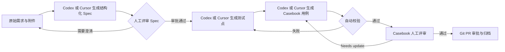

# AITest — Codex / Cursor 智能测试用例工作流

这是一套面向测试团队的、可评审、可追踪、可重复执行的测试用例生成流程。

测试人员只需要准备原始需求，可以任选 Codex 或 Cursor Agent 协助整理结构化 Spec、生成测试点和 Casebook 测试用例；人工负责两次关键评审，脚本负责检查格式、覆盖关系和质量门禁。

团队成员不需要全部订阅同一款 AI 工具。Codex 和 Cursor 共用仓库中的 `AGENTS.md`、`.agents/skills/`、Schema、校验脚本和 Casebook 资产，生成结果与评审标准完全一致。

> 核心原则：AI 负责生产测试资产，人负责确认需求理解和测试质量，Schema 与脚本负责确定性校验，Git 负责评审和留痕。

需要用于团队宣讲或项目介绍时，可直接分享：[智能测试工作流项目介绍](docs/智能测试工作流项目介绍.md)。

## 工作流程



完整链路为：

```text
原始需求与附件
→ Codex 或 Cursor 整理结构化 Spec
→ 人工确认 Spec
→ Codex 或 Cursor 生成测试点
→ Codex 或 Cursor 生成 Casebook 测试用例
→ 自动校验覆盖与格式
→ 人工评审用例
→ Codex 或 Cursor 根据意见修订
→ 评审通过并归档
```

## 谁负责什么

| 角色 | 主要职责 |
| --- | --- |
| 需求提供者 | 提供 PRD、接口说明、设计稿、业务规则等原始材料；回答待确认问题 |
| 测试设计人员 | 使用 Codex 或 Cursor 发起工作流，检查测试点和用例是否覆盖风险 |
| Spec 评审人 | 确认 AI Agent 是否正确理解需求，只能由人工批准 Spec |
| 用例评审人 | 在 Casebook 中检查覆盖、优先级、步骤和预期结果 |
| Codex / Cursor Agent | 整理需求、生成测试点和用例、根据评审意见修订资产 |
| 校验脚本 | 检查 Schema、ID、引用、覆盖、重复用例和模糊预期结果 |
| Git | 保存版本、评审记录、修改历史和最终审批 |

同一个测试人员可以承担多个角色，但不能省略两个人工门禁：Spec 审批和最终用例审批。

## 开始前准备

### 1. 安装软件

每位成员需要：

- Git。
- Python 3.10 或以上版本。
- 以下 AI 工具至少具备一种：Codex，或公司提供的 Cursor 账号。
- 可访问本仓库的权限。

确认环境：

```powershell
git --version
python --version
```

### 2. 选择并配置 AI 工具

| 使用者 | 工作模式 | Skill 调用方式 |
| --- | --- | --- |
| Codex 用户 | 从仓库根目录创建任务 | `$requirements-to-spec`、`$spec-to-test-points`、`$test-points-to-casebook` |
| Cursor 用户 | 从仓库根目录打开项目，使用 Agent 模式 | `/requirements-to-spec`、`/spec-to-test-points`、`/test-points-to-casebook` |

Codex 和 Cursor 必须打开同一个仓库根目录，不要只打开某个需求子目录。三个 Skill 的唯一维护位置是 `.agents/skills/`，不要复制到个人目录或维护 Cursor 专属版本。

Cursor 用户首次使用：

1. 使用 `File → Open Folder` 打开本仓库根目录。
2. 使用 `Ctrl+I`（macOS 为 `Cmd+I`）打开 Agent。
3. 新建 Agent 对话，在输入框键入 `/`，确认能看到三个测试 Skill。
4. 如果刚拉取或更新了 Skill 但未显示，先新建对话；仍未显示时运行命令面板中的 `Developer: Reload Window`。
5. Cursor 会通过 `.cursor/rules/testing-workflow.mdc` 自动加载项目工作流约束。

Cursor 对项目级 Skill 的支持可参考 [Cursor Agent Skills 官方文档](https://cursor.com/docs/skills)；项目规则参考 [Cursor Rules 官方文档](https://docs.cursor.com/context/rules)；Cursor CLI 也会读取仓库根目录的 `AGENTS.md`。[Cursor CLI 官方文档](https://docs.cursor.com/en/cli/using)

### 3. 获取仓库并安装依赖

```powershell
git clone git@github.com:LseaM/AITest.git
cd AITest
python -m venv .venv
.\.venv\Scripts\Activate.ps1
python -m pip install -r requirements.txt
```

macOS 或 Linux 激活虚拟环境：

```bash
source .venv/bin/activate
```

如果 PowerShell 阻止激活虚拟环境，可在当前窗口执行：

```powershell
Set-ExecutionPolicy -Scope Process -ExecutionPolicy Bypass
.\.venv\Scripts\Activate.ps1
```

依赖中已固定 `casebook==0.7.0`。上游版本和验证提交记录在 `casebook.lock`，不要自行升级；升级必须由维护者统一验证。

## 5 分钟验证环境

仓库内置了一套完整的登录需求示例。新成员安装依赖后，先运行：

```powershell
python scripts\validate_workflow.py `
  --requirement-dir docs\requirements\SPEC_LOGIN `
  --case-dir releases\pilot-login
```

看到以下信息代表工作流环境正常：

```text
校验通过：Spec、测试点、Casebook 用例和追踪关系均满足门禁。
```

再启动 Casebook：

```powershell
casebook serve releases\pilot-login
```

浏览器打开 [http://127.0.0.1:8089](http://127.0.0.1:8089)，应能看到登录测试用例并进行筛选、展开和标记。

停止 Casebook：在启动它的终端窗口按 `Ctrl+C`。

## 为一个新需求生成测试用例

下面以“订单退款”为例。请将示例中的 `SPEC_ORDER_REFUND`、`order-refund` 和版本目录替换成实际值。

### 第一步：创建需求目录

目录名称使用大写 `SPEC_<FEATURE>` 格式：

```text
docs/requirements/SPEC_ORDER_REFUND/
└── sources/
```

PowerShell 命令：

```powershell
New-Item -ItemType Directory -Force docs\requirements\SPEC_ORDER_REFUND\sources
```

把原始材料放入 `sources/`，支持：

- Markdown、TXT 等文本需求。
- Word 或 PDF 格式 PRD。
- 接口说明、数据库规则和状态流转说明。
- 设计稿截图、页面说明和其他附件。

原始文件是需求证据，放入后不要覆盖或改写。需求发生变化时新增版本文件，并在 Spec 中更新来源引用。

### 第二步：让 AI Agent 生成结构化 Spec

Codex 用户发送：

```text
请先阅读 AGENTS.md，并使用 $requirements-to-spec，
整理 docs/requirements/SPEC_ORDER_REFUND/sources/ 下的原始需求，
生成 docs/requirements/SPEC_ORDER_REFUND/spec.md。
```

Cursor 用户在 Agent 模式发送：

```text
请先阅读 AGENTS.md，并使用 /requirements-to-spec，
整理 docs/requirements/SPEC_ORDER_REFUND/sources/ 下的原始需求，
生成 docs/requirements/SPEC_ORDER_REFUND/spec.md。
```

如果当前工具没有自动显示该 Skill，使用兼容提示词：

```text
请先阅读 AGENTS.md 和
.agents/skills/requirements-to-spec/SKILL.md，
然后整理 docs/requirements/SPEC_ORDER_REFUND/sources/ 下的原始需求，
生成 docs/requirements/SPEC_ORDER_REFUND/spec.md。
```

AI Agent 会：

- 盘点并引用来源文件。
- 将需求拆成带 `REQ_*` ID 的原子需求。
- 整理范围、角色、主流程、规则、状态、权限、校验、异常和验收标准。
- 把推测放入“假设”，把无法确认的内容放入“待确认问题”。
- 将状态设置为 `draft`；存在阻塞问题时设置为 `needs_clarification`。

只检查 Spec 的结构和来源：

```powershell
python scripts\validate_workflow.py `
  --requirement-dir docs\requirements\SPEC_ORDER_REFUND `
  --spec-only
```

### 第三步：人工评审并批准 Spec

评审人重点确认：

- 是否漏掉需求范围、业务规则或关键异常。
- 每条原子需求是否可独立理解和验证。
- 来源引用是否真实、准确。
- “假设”有没有被误写成确定需求。
- “待确认问题”是否已经回答。

有问题时修改来源或补充答案，再让当前 AI Agent 更新 Spec。不得带着阻塞问题继续生成测试点。

确认通过后，由评审人修改 `spec.md` 顶部元数据：

```yaml
status: approved
reviewer: zhangsan
reviewed_at: "2026-07-17"
```

通过 Git PR 保存审批记录。`approved` 只能由人工填写，Codex 和 Cursor 都不得自行批准 Spec。

### 第四步：生成测试点

Codex 用户发送：

```text
请使用 $spec-to-test-points，
根据 docs/requirements/SPEC_ORDER_REFUND/spec.md，
生成 docs/requirements/SPEC_ORDER_REFUND/test-points.yaml。
```

Cursor 用户发送：

```text
请使用 /spec-to-test-points，
根据 docs/requirements/SPEC_ORDER_REFUND/spec.md，
生成 docs/requirements/SPEC_ORDER_REFUND/test-points.yaml。
```

未自动识别 Skill 时，让当前 AI Agent 先读取：

```text
AGENTS.md
.agents/skills/spec-to-test-points/SKILL.md
schema/test-points-schema.json
```

测试点会覆盖适用的正常、异常、边界、权限、状态流转、数据一致性和非功能风险，并通过 `requirement_ids` 关联原子需求。

### 第五步：生成 Casebook 测试用例

确定本次用例版本，例如 `releases/v1.0-order-refund/`。Codex 用户发送：

```text
请使用 $test-points-to-casebook，
根据 docs/requirements/SPEC_ORDER_REFUND/spec.md 和 test-points.yaml，
在 releases/v1.0-order-refund/ 下生成 Casebook YAML 测试用例，
并更新 docs/requirements/SPEC_ORDER_REFUND/traceability.yaml。
```

Cursor 用户发送：

```text
请使用 /test-points-to-casebook，
根据 docs/requirements/SPEC_ORDER_REFUND/spec.md 和 test-points.yaml，
在 releases/v1.0-order-refund/ 下生成 Casebook YAML 测试用例，
并更新 docs/requirements/SPEC_ORDER_REFUND/traceability.yaml。
```

未自动识别 Skill 时，让当前 AI Agent 先读取：

```text
AGENTS.md
.agents/skills/test-points-to-casebook/SKILL.md
schema/test-case-schema.json
schema/traceability-schema.json
```

AI Agent 会同时产生：

- `releases/v1.0-order-refund/<feature>.yaml`：Casebook 正式测试用例。
- `traceability.yaml`：`REQ → TP → TC` 全链路追踪关系。

不要在 Casebook 用例对象中添加 `requirement_ids` 或 `test_point_ids`。Casebook Schema 不允许额外字段，所有追踪关系必须写入独立矩阵。

### 第六步：运行完整校验

```powershell
python scripts\validate_workflow.py `
  --requirement-dir docs\requirements\SPEC_ORDER_REFUND `
  --case-dir releases\v1.0-order-refund
```

校验失败时，命令会列出所有问题并返回退出码 `1`。把完整错误信息交给当前使用的 Codex 或 Cursor：

```text
请读取 AGENTS.md，修复以下工作流校验错误。
保持已有 REQ、TP、TC ID 不变，修复后重新运行完整校验：

<粘贴校验错误>
```

只有看到“校验通过”才能进入正式用例评审。

### 第七步：在 Casebook 中评审

```powershell
casebook serve releases\v1.0-order-refund
```

评审人检查：

- 核心流程和高风险场景是否覆盖。
- 优先级是否与业务风险一致。
- 前置条件是否充分。
- 每个步骤是否只有一个明确动作。
- 每条预期结果是否可以观察或验证。
- 是否存在重复、过宽或无法执行的用例。

需要修改的用例使用 `Needs update` 和备注标记。新增、删除、拆分或重构用例时，不建议在页面中逐条维护；让当前 AI Agent 根据评审意见修改 YAML，并同步更新追踪矩阵：

```text
请读取本次 Casebook 评审标记和备注，
修订 releases/v1.0-order-refund/ 下的测试用例，
同步更新 docs/requirements/SPEC_ORDER_REFUND/traceability.yaml，
保留未发生实质变化的 TC ID，最后运行完整校验。
```

如果使用 Casebook 静态导出评审：

```powershell
casebook export releases\v1.0-order-refund `
  --output order-refund-review.html
```

可将导出的 HTML 分享给不能启动本地 Casebook 的评审人。静态页面中的评审备注需要通过 `Export review notes` 导出并交回用例维护者。

### 第八步：最终审批与归档

以下条件全部满足后才能审批：

- 完整校验通过。
- Spec 已审批且不存在待确认问题。
- Casebook 中所有阻塞级 `Needs update` 已处理。
- 每条需求都有测试点或经过人工批准的豁免。
- 每个测试点至少落到一个测试用例。
- 每个测试用例都能追踪到测试点和需求。
- 用例评审人完成最终确认。

提交 Git PR，评审通过后合并。需求、Spec、测试点、用例和追踪矩阵必须在同一个变更中保持一致。

## 产物目录

```text
.
├── AGENTS.md                         # Codex 与 Cursor 共用的仓库规则
├── README.md                         # 团队使用手册
├── .agents/skills/                   # 两端共用的三个测试工作流 Skill
├── .cursor/rules/                    # Cursor 自动加载的项目规则入口
├── docs/requirements/
│   └── <SPEC_ID>/
│       ├── sources/                  # 原始需求与附件
│       ├── spec.md                   # 结构化 Spec
│       ├── test-points.yaml          # 测试点
│       └── traceability.yaml         # REQ → TP → TC 追踪矩阵
├── releases/<version>/               # Casebook YAML 测试用例
├── schema/                            # 四份结构约束
├── scripts/validate_workflow.py       # 自动质量门禁
├── tests/                             # 校验器测试与非法样例
├── evals/                             # 试点指标和结果
├── requirements.txt                  # Python 固定依赖
└── casebook.lock                     # Casebook 上游版本记录
```

## 三类稳定 ID

| 资产 | 格式 | 示例 |
| --- | --- | --- |
| 原子需求 | `REQ_<FEATURE>_<NNN>` | `REQ_ORDER_REFUND_001` |
| 测试点 | `TP_<FEATURE>_<NNN>` | `TP_ORDER_REFUND_001` |
| 测试用例 | `TC_<FEATURE>_<NNN>` | `TC_ORDER_REFUND_001` |

ID 一旦进入评审就不得因为排序、插入或删除而改变：

- 新增内容使用新的尾号。
- 修改已有资产时保留仍有效的 ID。
- 不要在正式评审后使用 Casebook 的 ID 重排功能。
- 删除资产时同步更新追踪矩阵，并使用 Git 保存历史。

## 自动校验会检查什么

- Spec Front Matter、测试点、追踪矩阵和 Casebook 用例是否符合 Schema。
- Spec 是否引用真实存在的来源文件。
- Spec 是否已经人工批准并填写评审信息。
- 已批准 Spec 是否仍包含未解决的待确认问题。
- REQ、TP、TC ID 是否重复或引用不存在。
- 每条需求是否有测试点或带理由、评审人的人工豁免。
- 每个测试点是否至少关联一个用例。
- 每个用例是否至少由一个测试点支撑。
- Casebook 用例是否包含非法额外字段、空步骤或空预期结果。
- 是否存在完全重复用例。
- 是否存在只有“正常”“正确”“操作成功”等不可验证的模糊预期。

校验脚本解决结构和确定性问题，不能代替人工判断业务理解、风险优先级和真实可执行性。

## 日常常用命令

```powershell
# 安装依赖
python -m pip install -r requirements.txt

# 只检查 Spec
python scripts\validate_workflow.py `
  --requirement-dir docs\requirements\<SPEC_ID> `
  --spec-only

# 检查完整链路
python scripts\validate_workflow.py `
  --requirement-dir docs\requirements\<SPEC_ID> `
  --case-dir releases\<version>

# 启动本地用例评审
casebook serve releases\<version>

# 导出离线评审 HTML
casebook export releases\<version> --output <review-file>.html

# 运行校验器自动化测试
python -m unittest discover -s tests -v
```

## 常见问题

### 1. Codex 或 Cursor 没有显示三个 Skill

不用中断工作。直接在提示词中要求当前 AI Agent 读取：

```text
AGENTS.md
.agents/skills/<skill-name>/SKILL.md
```

然后描述目标路径。仓库规则和 Skill 文件本身就是完整工作契约。

Cursor 用户应先新建 Agent 对话；如果仍未显示，执行 `Developer: Reload Window`。在 Cursor 中还可以用 `@AGENTS.md` 和 `@.agents/skills/<skill-name>/SKILL.md` 显式加入上下文。

### 2. Cursor 能看到 Skill，但当前对话没有使用

Cursor 的 Skill 列表在对话开始时载入。拉取新版本或修改 Skill 后，请新建 Agent 对话，不要继续使用更新前已经打开的旧对话。需要确定性调用时直接输入 `/skill-name`，不要只依赖自动选择。

### 3. 报错“Spec 状态必须为 approved”

说明 Spec 尚未完成首次人工评审。先解决“待确认问题”，由评审人填写 `status: approved`、`reviewer` 和 `reviewed_at`，再生成测试点和用例。

### 4. 报错“声明的来源文件不存在”

检查 `spec.md` 中 `source_files` 的相对路径。路径必须从当前需求目录开始，并指向 `sources/` 下真实存在的文件。

### 5. 报错“映射引用不存在”或“资产未覆盖”

`spec.md`、`test-points.yaml`、Casebook YAML 和 `traceability.yaml` 没有同步修改。让当前 AI Agent 读取四类产物，保留已有 ID，并补齐或删除失效映射。

### 6. Casebook 提示 YAML 字段不合法

Casebook 用例只允许 `schema/test-case-schema.json` 中定义的字段。REQ 和 TP 的关联不要写进测试用例，写入 `traceability.yaml`。

### 7. Casebook 命令不存在

确认已激活虚拟环境，再执行：

```powershell
python -m pip install -r requirements.txt
casebook --version
```

预期版本为 `0.7.0`。

### 8. Word、PDF 或图片无法可靠读取

不要让 AI Agent 猜测。将关键内容补充成 Markdown 或文本，保留原文件作为来源，并在 Spec 的“待确认问题”中记录无法确认的部分。

### 9. 需求发生变更怎么办

新增需求来源文件，更新 Spec 版本和来源引用，再依次更新测试点、用例和追踪矩阵。每次修改都运行完整校验，保留仍然有效的 REQ、TP、TC ID。

## 新成员上手检查表

- [ ] 已安装 Git、Python，并具备 Codex 或 Cursor 中至少一种工具。
- [ ] 已从仓库根目录打开所选 AI 工具。
- [ ] Codex 能看到 `$skill-name`，或 Cursor 的 `/` 菜单能看到三个 Skill。
- [ ] 已创建并激活 `.venv`。
- [ ] `python -m pip install -r requirements.txt` 执行成功。
- [ ] 登录示例完整校验通过。
- [ ] 能在浏览器打开 Casebook 示例用例。
- [ ] 知道原始需求必须放入 `sources/` 且不能被覆盖。
- [ ] 知道任何 AI Agent 都不能自行把 Spec 改成 `approved`。
- [ ] 知道完整校验通过后才能进入最终评审。
- [ ] 知道正式评审后不能重排 REQ、TP、TC ID。
- [ ] 能区分 Casebook 评审标记和 Git 最终审批的职责。

完成以上检查后，即可独立使用本工作流处理真实需求。
