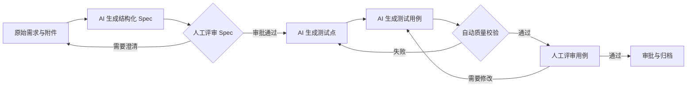

# 智能测试用例工作流项目介绍

> 团队分享版
> 更新日期：2026-07-29

## 项目简介

这是一套由 Codex 或 Cursor Agent 辅助、测试人员负责关键判断、自动规则保障质量的测试用例工作流。

它将原始需求逐步转换为：

- 可评审的结构化 Spec。
- 可追踪的测试点。
- 格式统一的测试用例。
- 从需求到用例的完整覆盖关系。

核心原则是：

> AI 负责生产测试资产，人负责确认需求理解和测试质量，Schema 与脚本负责确定性校验，Casebook 负责评审，Git 负责版本与留痕。

## 项目背景

传统测试用例设计经常存在以下问题：

- 不同测试人员对同一需求的理解不一致。
- PRD 中的歧义、缺失和隐含假设发现得太晚。
- 测试点与测试用例缺少统一的设计方法。
- 需求、测试点和测试用例之间难以追踪。
- AI 可以快速生成内容，但输出格式和质量不稳定。
- 评审意见没有沉淀为可复用的团队规则。

本项目不是简单增加一个“AI 生成用例”功能，而是建立一条可评审、可校验、可追踪、可持续改进的测试资产生产流程。

## 项目目标

1. 提前发现需求歧义、冲突和信息缺失。
2. 统一团队的测试分析与用例设计方法。
3. 减少重复整理需求和编写基础用例的时间。
4. 建立需求、测试点、测试用例之间的追踪关系。
5. 通过人工评审和自动校验控制 AI 输出质量。
6. 将测试方法沉淀为团队可复用的 Skill、Schema 和规则。

## 完整工作流程

流程分为八个阶段：

1. 收集 PRD、接口说明、设计稿和业务规则等原始材料。
2. AI 将原始需求整理为结构化 Spec。
3. 测试人员确认 AI 对需求的理解是否正确。
4. AI 根据已审批 Spec 生成测试点。
5. AI 将测试点展开为测试用例。
6. 自动检查格式、覆盖关系、重复内容和断链引用。
7. 测试人员在 Casebook 中评审用例并提出修改意见。
8. 校验和评审通过后，通过 Git 完成审批与归档。

## 核心机制

### 1. 结构化 Spec

AI 首先整理需求范围、角色、业务规则、状态流转、权限、异常流程和验收标准，并将需求拆分为带稳定 ID 的原子需求。

未经确认的内容必须进入“假设”或“待确认问题”，不能作为确定需求继续生成用例。

### 2. 双重人工评审

流程设置两个不可跳过的人工门禁：

- Spec 评审：确认 AI 是否正确理解需求。
- 用例评审：确认风险覆盖、优先级和可执行性。

AI 不能自行批准 Spec，也不能代替测试人员完成最终判断。

### 3. 全链路追踪

项目为三类资产分配稳定 ID：

| 资产 | ID 示例 |
| --- | --- |
| 原子需求 | `REQ_LOGIN_001` |
| 测试点 | `TP_LOGIN_001` |
| 测试用例 | `TC_LOGIN_001` |

通过 `REQ → TP → TC` 追踪关系，可以明确：

- 每条需求由哪些测试点覆盖。
- 每个测试点落到了哪些测试用例。
- 哪些需求仍未覆盖。
- 需求变化会影响哪些测试资产。

### 4. 自动质量门禁

自动校验主要检查：

- Spec 是否经过人工审批。
- 结构和字段是否符合 Schema。
- ID 是否重复。
- 是否存在无效引用和孤立资产。
- 每条需求是否有测试点或人工豁免。
- 每个测试点是否至少关联一个用例。
- 是否存在空步骤、模糊预期或明显重复用例。

自动校验解决确定性问题，不能代替人工业务判断。

### 5. 评审反馈闭环

测试人员在 Casebook 中标记需要修改的用例并记录原因，AI 根据反馈修订用例和追踪关系。

评审意见会逐步沉淀到 Skill、规则和质量标准中，使后续生成更加稳定。

## Codex 与 Cursor 双端支持

团队成员可以根据现有账号选择 Codex 或 Cursor。

两种工具共用：

- 同一份项目规则。
- 同一套测试 Skill。
- 同一套 Schema。
- 同一个校验器。
- 同一种测试用例格式。
- 同一套评审与追踪标准。

因此团队不需要维护两套流程，最终产物也不会因使用工具不同而改变。

## 人员职责

| 角色 | 主要职责 |
| --- | --- |
| 需求提供者 | 提供完整需求材料并回答待确认问题 |
| 测试设计人员 | 使用 AI 生成 Spec、测试点和测试用例 |
| Spec 评审人 | 确认需求理解并批准 Spec |
| 用例评审人 | 检查风险覆盖、优先级和可执行性 |
| AI Agent | 整理需求、生成资产、根据反馈修订 |
| 自动校验器 | 检查结构、引用、覆盖和重复问题 |
| Git | 保存版本、评审记录和审批历史 |

同一个测试人员可以承担多个角色，但不能省略 Spec 审批和最终用例审批。

## 预期价值

### 对测试人员

- 减少从空白开始分析需求和编写用例的时间。
- 使用统一方法覆盖正常、异常、边界、权限和状态风险。
- 将更多精力投入业务判断和高风险场景。

### 对测试负责人

- 能够查看需求到用例的覆盖关系。
- 能够发现 P0 需求遗漏、重复用例和错误假设。
- 评审过程具备明确门禁和审计记录。

### 对团队

- 不依赖某一个 AI 产品或少数人员账号。
- 测试方法沉淀为团队资产，而不是个人经验或聊天记录。
- 即使未来更换模型或工具，结构化测试资产仍可继续使用。

## 试点评估指标

首期通过简单功能、复杂状态流程和高风险业务三类真实需求进行验证。

重点关注：

| 指标 | 首期目标 |
| --- | --- |
| Schema 通过率 | 100% |
| 追踪引用有效率 | 100% |
| 原子需求覆盖率 | 100%，未覆盖必须有人工豁免 |
| P0 需求遗漏 | 0 |
| 无依据的高风险假设 | 0 |
| 明显重复用例率 | 不高于 5% |
| 无需大改即可执行的用例比例 | 不低于 80% |
| 测试设计与评审中位耗时 | 相比基线至少降低 30% |

最终验证的不是 AI 能生成多少用例，而是：

> 在不增加严重遗漏和错误假设的前提下，是否减少测试设计与评审时间，并提高覆盖质量和稳定性。

## 当前建设边界

首期不包含：

- 自研通用 AI Agent。
- 大规模知识库或复杂 RAG。
- 由 AI 自动替代人工审批。
- 自动执行所有测试用例。
- 直接接入需求、缺陷或设计平台。

当前阶段的重点是先通过真实需求验证工作流价值。只有质量和效率提升得到数据证明后，再考虑平台化、历史知识检索和更多系统集成。

## 项目共识

1. AI 生成不是最终结果，经过评审和校验的测试资产才是结果。
2. 输入质量决定输出上限，结构化 Spec 是第一道质量关。
3. AI 不负责最终业务判断，测试人员必须保留审批权。
4. Skill、Schema、规则和评测数据是团队长期资产。
5. 工作流不绑定 Codex、Cursor 或其他单一产品。
6. 先验证真实价值，再决定是否平台化。

---

具体操作步骤请参阅项目 [README](../README.md)。
